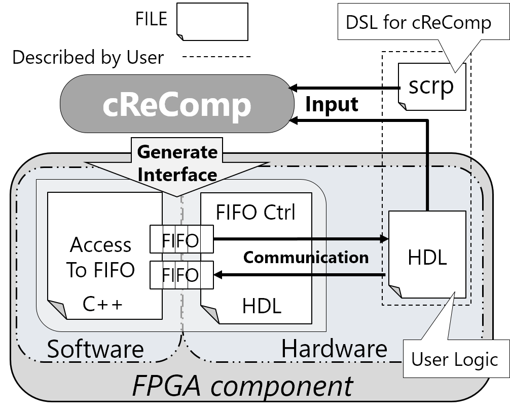

# cReCompを使ってXillybusとユーザロジックを簡単につなげよう

# はじめに

この記事では僕が開発中で，FPGAのための開発支援ツールである**cReComp**について紹介しようと思います。  
もし，cReCompの機能をお試しいただけるのでしたら，**Ubuntu**か**OSX(MacOS)**が動作するPCさえあれば可能です。  

# cReCompとは

cReComp (creator for Reconfigurable Component)はZynqやCyclone VなどのProgrammable SoC上において，
Verilogで記述された回路を**ソフトウェアコンポーネント化**するためのツールとフレームワークを提供します。  

具体的には何をするのためのものなのかというと，簡単な設定記述をすることで，自分で書いたVerilogの回路(以降ユーザロジック)がプロセッサと自動的につながり，ソフトウェアとFPGA上の回路間でデータのやり取りができるようにします。
cReCompにおける設定記述は**Pythonによる言語内DSL**か，僕が作っているcReCompのためのDSL，**Scrp (specification for cReComp)**を使用して行うことができます。

インストールは以下のURLからよろしくお願いいたします。`pip install`もできるようになっていますが，**現在絶賛開発中**ですので`git clone`してから`python setup.py install`のほうが最新版が手に入ると思います。  
[Github cReComp](https://github.com/kazuyamashi/cReComp.git)

# Xillinuxについて

XillinuxはXillybusからリリースされており，ZynqやCyclone VなどのCPUとFPGAを搭載したProgrammable SoCを対象としたUbuntu OSです．XillinuxではFPGAとCPUがFIFOをバッファを介してデータ通信が行えるIPを提供しています．Xillinuxの試用版がサポートしているFIFOバッファのビット幅は32ビットと8ビットです．このFIFOバッファの制御をFPGA上において行うことによってFPGAとCPU間のデータ通信が実現できます．  
**cReCompではこのXillinuxのFIFOバッファをサポートしており，使用することができます．**  
今回はこのXillinuxを使用する前提です。[Xillinuxの導入については以前に記事を書いていますのでそちらをご参照ください。](http://qiita.com/kazuyamashi/items/b49df82dc8d868364d53)  
ほかの通信機構についてはこれから実装予定です。

# cReCompで開発してみる

前にも書きましたが，cReCompにおいて設定記述をするスタイルは2つあります。1つはcReCompが提供するフレームワーク(言語内DSL)を用いて設定する仕方です。この方法に関しましてはGithubのリポジトリのREADMEに[Getting Started](https://kazuyamashi.github.io/crecomp_doc/getting_started_jp.html)(日本語)を用意しておりますのでそちらをご参照ください。

したがってこの記事ではScrpによる設定方法とコード生成の仕方を紹介します。
<center></img></center>

## 今回扱うユーザロジック

クローンしたディレクトリの中にverilog/sonic_sensor.vがあるか確認してください。このファイルはハードウェア記述言語であるVerilog HDLで記述されています。  
この回路はある超音波センサを制御するための回路で`req`に1を入力すると`out_data`からセンサ値が返ってくるという仕様です。  
また，処理中はbusyが立ち，処理が完了するとfinishが立ちます。このようなハンドシェークができる回路とcReCompの相性はいいです。  
今回はセンサ値が必要な時はソフトウェアから信号を送ってソフトウェアでデータを参照することを想定します。

```verilog
//  verilog/sonic_sensor.v
`timescale 1ns / 1ps
module sonic_sensor(
	input clk,
	input rst,
	input req,
	output [0:0] busy,
	inout sig,
	output finish,
	output [31:0] out_data
);
	parameter STATE_INIT            = 0,
				 STATE_IDLE         = 1,
				 STATE_OUT_SIG      = 2,
				 STATE_OUT_END      = 3,
				 STATE_WAIT750      = 4,
				 STATE_IN_SIG_WAIT  = 5,
				 STATE_IN_SIG       = 6,
				 STATE_IN_SIG_END   = 7,
				 STATE_WAIT200      = 8,
				 STATE_PROCESS_END  = 9;
	reg [3:0] state;
	reg [31:0] echo;
.
.
.
```


## Scrpファイルのテンプレート生成
cReCompではコンポーネント化するためのScrpファイルのテンプレートを自動生成できます。テンプレートは，以下のコマンドで生成できます。また、テンプレート生成の際は，テンプレートファイルの名前とコンポーネント化対象のユーザロジックへのパスを指定してください。

```
$ crecomp -u sonic_sensor.v -s sensor_ctl.scrp
```

テンプレートファイルの生成に成功すると，sensor_ctl.scrpというファイルができているはずです。また，生成されたファイルの内容は以下ようなコードのようになっています。  
テンプレート生成時にユーザロジックの指定をすると以下のようにユーザロジックの持つ入出力ポートが読み込まれ，必要な記述が自動的に生成されます。  
Verilogの解析には[pyverilog](https://github.com/PyHDI/pyverilog)と[veriloggen](https://github.com/PyHDI/veriloggen)を使用しています。
`#`はコメントです。

```
component_name ""

# communication xillybus 1 1 "1" 32
# xillybus32_rcv ""
# xillybus32_snd ""

userlogic_path "sonic_sensor.v" instance_name "uut"
userlogic_assign
	input,1,clk =
	input,1,rst =
	input,1,req =
	output,1,busy =
	inout,1,sig =
	output,1,finish =
	output,32,out_data =
assign_end

end

```

## コンポーネントの設定と生成

早速コンポーネント化のための設定記述を指定きましょう。

### プロジェクト名(コンポーネントの名前)

コンポーネントの名前は以下のように指定できます。

```
component_name "sensor_ctl"
```

### ユーザロジックへ配線するための信号を宣言する
以下の書式(信号のタイプ ビット幅 "名前")に従い，ユーザロジックの配線に必要な信号を宣言します。

```
# コンポーネントのクロックとリセット信号
input 1 "clk"
input 1 "rst"

# inout信号"sig"へ配線するための信号
inout 1 "sig_out"

# "finish" and "busy"へ配線するための信号
wire 1 "finish_flag"
wire 1 "busy_flag"
```

`req`と`out_data`はまだ宣言していません。ユーザロジックとソフトウェア間の通信の設定を行う際に改めて宣言します。従ってここではソフトウェアとデータ通信が必要なポート以外のポートのための信号を宣言します。

###　通信ロジックの設定と信号の宣言

すでにテンプレートにあったコメントを解除し，以下ように設定します。

```
# Xillybus rcv_cycle snd_cycle rs_cond fifo_width
# @param rcv_cycle  : ユーザロジックがCPUからデータを受け取る回数
# @param snd_cycle  : ユーザロジックがCPUへデータを送る回数
# @param rs_cond    : データの受信と送信の切り替える条件
# @param fifo_width : FIFOバッファのビット幅

communication xillybus 1 1 "finish_flag && busy_flag != 0" 32
```

次に通信に必要な信号を宣言します。また，信号を宣言したのち，XillybusのFIFOバッファへアサインする必要があります。  
アサインする際はすでに宣言済みの信号でなくてはなりません。  
また，ソフトウェア→ユーザロジック方向のデータを受信する場合は**rcv**，ユーザロジック→ソフトウェア方向にデータを送信する場合は**snd**です。  
すなわち，どのレジスタにデータを受け取るか，またどのワイヤに流れているデータを送り出すかを決めます。

```
# CPUからデータを受信するためのレジスタ
# 32ビットのFIFOのため，合計32ビット分用意する

reg 31 "dummy"
reg 1 "req_reg"

# CPUへデータを送信するための内部ワイヤ

wire 32 "sensor_data"

# req_reg，dummyの順でアサインする．
# アサインした順にFIFOのLSBから割当てられる．

xillybus32_rcv "req_reg"
xillybus32_rcv "dummy"

# データ送信用の信号をアサイン

xillybus32_snd "sensor_data"

```

### ユーザロジックへ信号のアサインをする

ユーザロジックへの信号をアサインするための記述はcReCompによってテンプレートファイルを生成した際に，自動的に記述されてあります。  
ユーザロジックへのアサインはコンポーネントの設定を行うにあたり自分で宣言した信号をアサインしてください．今回は以下のようにアサインしましょう．  

```
userlogic_path "sonic_sensor.v" instance_name "uut"
userlogic_assign
	input,1,clk = clk
	input,1,rst = rst
	input,1,req = req_reg
	output,1,busy = busy_flag
	inout,1,sig = sig_out
	output,1,finish = finish_flag
	output,32,out_data = sensor_data
assign_end
```

### 設定ファイルの完成版

設定記述が終了したファイルは以下のようになっていると思います。

```
component_name "sensor_ctl"

input 1 "clk"
input 1 "rst"
inout 1 "sig_out"
wire 1 "finish_flag"
wire 1 "busy_flag"

reg 31 "dummy"
reg 1 "req_reg"

wire 32 "sensor_data"

xillybus32_rcv "req_reg"
xillybus32_rcv "dummy"

xillybus32_snd "sensor_data"

userlogic_path "sonic_sensor.v" instance_name "uut"
userlogic_assign
	input,1,clk = clk
	input,1,rst = rst
	input,1,req = req_reg
	output,1,busy = busy_flag
	inout,1,sig = sig_out
	output,1,finish = finish_flag
	output,32,out_data = sensor_data
assign_end

end
```

### 生成

以下のコマンドでコンポーネントを生成しましょう。生成に成功すると`Generate component successfully`と出力されます。

```
$ crecomp -b sensor_ctl.scrp
```


###　生成されたコンポーネント

生成に成功すると指定したコンポーネントの名前のディレクトリができます。
hardwareにはFPGA上において動作する回路記述が，softwareにはCPU上で動作するソフトウェアが入っています。
ユーザロジックとデータのやり取りを行う際はこのソフトウェアを使用して行うことができます。

```
sensor_ctl/
|--hardware/
	|--sensor_ctl.v
	|--sonic_sensor.v
|--software/
	|--sensor_ctl.cpp
	|--lib_cpp.h
	|--Makefile
```

例えば，生成されたソフトウェアは以下のようなコードです。

```c
#include "lib_cpp.h"
#include <iostream>
using namespace std;

class sensor_ctl_32 :public If_module{
	unsigned int sensor_ctl_dout_32;
	unsigned int sensor_ctl_din_32;
public:
	sensor_ctl_32(){}
	~sensor_ctl_32(){}
	unsigned int get_sensor_ctl_32();
	void set_sensor_ctl_32(unsigned int argv);
};
unsigned int sensor_ctl_32::get_sensor_ctl_32(){
	int rc = 0;
	while(1){
		rc = read(fr, &sensor_ctl_dout_32, sizeof(sensor_ctl_dout_32));
		if(rc < 0){
			cout << "fail read from fifo" << endl;
			continue;
			}
		else if(rc == sizeof(sensor_ctl_dout_32)) break;
		}
	return sensor_ctl_dout_32;
}

void sensor_ctl_32::set_sensor_ctl_32(unsigned int argv){
	int rc = 0;
	sensor_ctl_din_32 = argv;
	while(1){
		rc = write(fw, &sensor_ctl_dout_32, sizeof(sensor_ctl_din_32));
		if(rc < 0){
			cout << "fail write to fifo" << endl;
			continue;
		}
		else if (rc == sizeof(sensor_ctl_din_32)) break;
	}
	return;
}


int main(int argc, char const *argv[]){

	sensor_ctl_32 cp_32;
	cp_32.set_devfile_read("/dev/xillybus_read_32");
	cp_32.open_devfile_read();
	cp_32.set_devfile_write("/dev/xillybus_write__32");
	cp_32.open_devfile_write();


	///Please deicribe your code///

	cp_32.close_devfile_read();
	cp_32.close_devfile_write();

	return 0;
}
```

#　おまけ　FPGA×ROS
僕自身，FPGAとロボットというテーマで研究を行っていることもあり，
実はこのcReCompは最近ロボットのソフトウェアプラットフォームとして話題となっている**ROS**のパッケージ生成機能も付けてあります。  
scrpの中に`generate_ros_package`と記述すると自動的にROSパッケージを生成してくれます。ぜひお試しください。  

FPGA×ROSに関しては関連記事がありますのでご参照ください。

- [FPGA×ROSでFPGAをプラットフォームとしたロボットを実現するプロジェクトOpenReroc](http://qiita.com/kazuyamashi/items/47fc69ac955f110d55bc#_reference-e3ff8cb68c8002160f7a)
- [ROSについて学ぼう](https://kazuyamashi.github.io/ros_lecture/index.html)
- [OpenReroc](https://github.com/Kumikomi/OpenReroc)


ちなみに生成物は`software/`の中の`ros_package`内に生成されます。

```
sensor_ctl/
|--hardware/
	|--sensor_ctl.v
	|--sonic_sensor.v
|--software/
|	|--ros_package/
|		|--sensor_ctl/
|			|--include/
|			|--msg/
|			|--src/
|			|--CMakeLists.txt
|			|--package.xml
|--sensor_ctl.cpp
|--lib_cpp.h
|--Makefile
```

# おわりに

今回は私の開発しているツールcReCompの紹介とScrpをもちいた場合の開発手順について説明いたしました。  
何度も言いますが**絶賛開発中**ですのでまだまだ実装が甘いところがあると思いますがご了承ください。  
使用してみての感想だったり，バグ報告とかしていただけるととてもうれしいです。  
またツールに関するご質問もお気軽にお寄せください。

##### 連絡先と筆者のwebサイト

Email：kazushi_at_virgo.is.utsunomiya-u.ac.jp  
Twitter:[KazushihuzaK](https://twitter.com/KazushihsuzaK)  
Github:[kazuyamshi](https://github.com/kazuyamashi)  
HP : [Kazushi Yamashina](https://kazuyamashi.github.io/)
