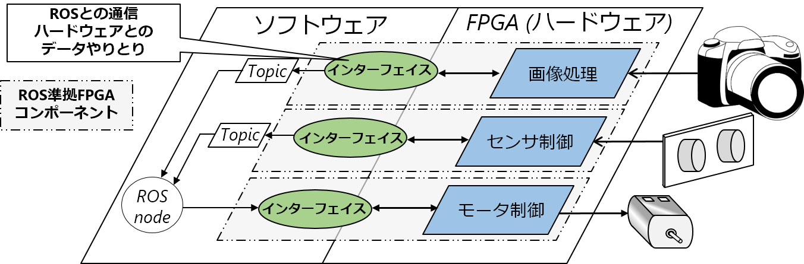

<h2>cReComp　ワークショップ</h2>
<h5>
宇都宮大学大学院工学研究科 
情報システム科学専攻 
横田・大津・大川研究室 
山科和史 
kazushi@virgo.is.utsunomiya-u.ac.jp 
</h5>

## はじめに
周囲の状況に応じて行動する**自律移動型ロボット**は知的画像処理などの非常に複雑活膨大な計算を行う必要があります。
高い処理性能が要求されているの対し自律移動型ロボットのバッテリ駆動のため，低消費電力化の観点から処理性能の高いプロセッサは搭載できず処理性能不足となる問題があります。  
我々はこうした問題を解決するために，ロボット制御のプラットフォームとして電力性能比が高い**FPGA(Field Programmable Gate Array)**に注目しています。しかし，FPGAにおける開発は一般のプログラミング言語(CやJava)に比べて**HDL(Hardware Description Language)**による開発となるため，開発者への負担が大変大きいです。このような問題を解決し，FPGAを容易にロボットへ導入するため，ロボットシステムの開発運用のためのソフトウェアプラットフォームである***ROS**に準拠した，FPGAのソフトウェアコンポーネント化を提案しています。  
本ワークショップでは実際に**FPGA向けの回路のコンポーネント化**，**コンポーネントのROSへの統合**を実際に体験していただ区ことができます。

**ワークショップ中に扱うの専門用語の詳しい解説については[別途資料](support_doc.html)をご参照ください。**  

##FPGAのROS準拠コンポーネント化
FPGAのROS準拠コンポーネント化を行う最大の目的はFPGAの利点を生かしつつ，ソフトウェアによる制御を可能にすることで，FPGAを容易にロボットへ導入できるようにすることです。以下のようなソフトウェアのみで構築されたシステムにおいて処理不足となるような処理をFPGAによってハードウェア化し，ソフトウェアとの通信を行なうインターフェイスを設けることで，ハードウェアを意識することなくソフトウェアと同一に扱うことができます。この際，コンポーネントは**ロボット向けソフトウェア開発プラットフォームのROS(Robot Operating System)**のプロセス通信モデルに準拠します。

	
	

##　本ワークショップにおいて期待される効果
- ROSを採用したロボットシステムのソフトウェア設計フローが理解できるようになる．
- cReCompを用いてFPGA向けの回路をROSコンポーネント化し，その動作を検証できるようになる．
- ROSフレームワークにコンポーネントを統合し，FPGAを用いたロボットシステムの設計ができるようになる

## ワークショップの内容
#### cReCompを用いたハードウェアのコンポーネント化とROSへの統合 

大きく分けて3つのStepがあります。

1. cReCompというツールを用いてVerilog HDLで記述されたハードウェア回路をコンポーネント化する
- コンポーネントの動作検証
- ロボット開発・運用のためのソフトウェアプラットフォームであるROSへ作成したコンポーネントを統合と動作検証

##　ワークショップ中の注意事項

- **作業中の休憩は自由に取っていただいてかまいません。また，途中で気分が悪くなった場合もお申し付けください。**

## 作業手順
[step0: 準備](step0.html)  
[step1: cReCompを用いてVerilog HDLで記述されたハードウェア回路をコンポーネント化](step1.html)  
[Step2: コンポーネントの動作検証](step2.html)  
[Step3: ROSへコンポーネントと統合と動作検証](step3.html)  
[Step4: おまけ](step4.html)  

<!-- ## 時間の記入
以下のURLにて時間の入力の記入をお願いします。  
[時間入力フォーム](http://goo.gl/forms/jBFCdQA3aN) -->

##アンケート
ワークショップ終了後、以下のURLでアンケートに回答してください。  
[アンケート入力フォーム](http://goo.gl/forms/2rMYIMClPp)
