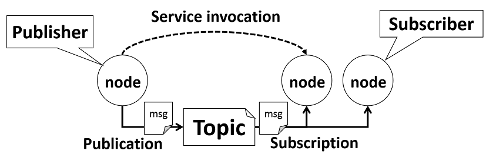

#### Step3: ROSへコンポーネントと統合と動作検証<br>(Zedboard：Teratermでの作業)

#####　ROSとは
Open Source Robotics Foundationが開発・メンテナンスを行っており，ロボット開発者を支援するためのソフトウェアプラットフォームです。具体的にはロボットに必要なソフトウェアを開発するためのライブラリ，通信の仕組みを提供します。また，同時にビルドツールでもありワークディレクトリのビルド対象を全て一括でビルドできる**catkin_make**というコマンドを用いてビルドを行うという特徴があります。

##### ROSの通信モデル


ROSでは***Publish/Subscribeメッセージング***と呼ばれる通信モデルで**ノード（ソフトウェア）同士**が通信します。
各要素の機能は以下とおりです。

- Message：ROSで使用するデータの呼び名。中身のデータ構造はROSにあらかじめ用意されているものか独自の定義が可能
- Topic：メッセージを分類する系統ごとに作成される論理チャネル
- Publisher：メッセージを特定のトピックへ配信する
- Subscriber：特定のトピックを購読対象として登録しメッセージを受信する

ROSではこのようにPublisherとSubscriberがtopicを介してMessageをやり取りすることでデータ通信をします。
Publish/Subscribeの特徴として，P2Pな通信であることがあげられます。これは，お互いが通信相手の情報を知る必要はなく，ノード構成ネットワークへの脱退，参加が容易になります。
つまりこれはシステムへの機能の追加・変更がとても楽に行えることを意味します。また，1対1の通信専用の方法としてROS Serviceというものもあります。

##### ROSのワークスペースを作る
ROSのワークスペースを作ります。以下のコマンドを入力してください。
また，ROSに関するツールを使えるようにするため，パスを通しておきます。

```
cd ~workshop_crecomp/
mkdir -p ros_ws/src
cd ros_ws
source /opt/ros/groovy/setup.bash
```

ここで一度makeしておきます。ROSでは***catkin_make***というコマンドを使ってワークスペースのプロジェクトをビルドします。また，初回でこのコマンドを行えばワークスペースに必要なファイルやディレクトリが生成されます。

```
catkin_make
```

catkin_makeしたら以下のようなファイル階層になっていると思います。

```
ros_ws
|--build
|--devel
|--src
```

- build
 - ビルドに関する設定やmakeのlogのファイルが入っています。
- devel
 - 実行ファイルやmakeによって生成されたものが入っています。
- src
 - ユーザがソースコードを保存する場所です。

これでワークスペースはできました。

##### ROSパッケージを作る

ROSでは任意の機能をつめたソフトウェアの集合を**パッケージ**と呼びます。
パッケージの雛型は***catkin_create_pkg***で作成することができます。また***catkin_create_pkg***のコマンド引数は以下のとおりです。

```
catkin_create_pkg [package_name] [depend1] [depends2] ...
```
コンソールに以下のコマンドを入力してください。

```
cd src
catkin_create_pkg openreroc_motionsensor roscpp std_msgs
```

この場合，パッケージの名前はopenreroc_motionsensor，また依存関係を持たせるパッケージはroscpp，std_msgsということになります。
ワークスペースでもう一度catkin_makeしましょう。

```
cd ~workshop_crecomp/ros_ws/
catkin_make
```

##### ROSのコーディング
ここではROSの具体的なコーディングを行います。
######ROS message
ROSでは処理に必要なデータは基本的にメッセージとして通信を行ないます。
そのメッセージのデータ構造はさまざまなデータ型から任意のものを選択して独自のデータ構造にすることができます。
たとえば，データ型には以下のものがあります。

- int8, int16, int32, int64 (plus uint*)
- float32, float64
- string
- time, duration
- other msg files
- variable-length array[] and fixed-length array[C]

メッセージファイルを作成します。

```
cd ~/workshop_crecomp/ros_ws/src/openreroc_motionsensor
mkdir msg; cd msg
touch sonic_sensor.msg
emacs sonic_sensor.msg
```

メッセージファイル***sonic_sensor.msg***の中には以下の記述をしてください。
このmsgファイルでは32bitのunsigned int型の変数を1個保有していることになります。

**sonic_sensor.msg**

```
uint32 sensor_data
```

このメッセージファイルを元にメッセージ型を定義するヘッダファイルが生成されます。
ヘッダファイル生成の設定を行うため以下のファイルを編集してください。  
<!-- **WinSCPでファイルを編集する際は編集したファイルのタイムスタンプをtouchコマンドで更新してください。** -->

```
cd ~/workshop_crecomp/ros_ws/src/openreroc_motionsensor
emacs CMakeLists.txt
```

**CMakeLists.txt**

```diff
#該当意部分がはコメント解除して適宜修正
#7行目あたり
find_package(catkin REQUIRED COMPONENTS
	roscpp
	std_msgs
+ message_generation
)

#45行目あたり
## Generate messages in the 'msg' folder
add_message_files(
	 FILES
- #   Message1.msg
- #   Message2.msg
+  sonic_sensor.msg
 )

#66行目あたり
generate_messages(
	 DEPENDENCIES
	 std_msgs
)

#94行目あたり
include_directories(
	${catkin_INCLUDE_DIRS}
+  include/${PROJECT_NAME}
)
```

catkin_makeしましょう。

```
cd ~/workshop_crecomp/ros_ws
catkin_make
```

catkin_makeに成功すると以下のディレクトリにメッセージを定義したヘッダファイルが生成されます。  

`less ~/workshop_crecomp/ros_ws/devel/include/openreroc_motionsensor/sonic_sensor.h`

```cpp
//…
namespace openreroc_motionsensor
{
template <class ContainerAllocator>
struct sonic_sensor_
{
	typedef sonic_sensor_<ContainerAllocator> Type;

	sonic_sensor_()
		: sensor_data(0)  {
		}
	sonic_sensor_(const ContainerAllocator& _alloc)
		: sensor_data(0)  {
		}
//…
```

###### ROSのノードを記述する
ROSのノードをC++言語で記述していきます。  
以下のコマンドでROSにおけるノード(ソフトウェア)となるソースコードをワークスペースに追加します。  
基本的にStep1で生成したソースコード(ソフトウェア)をROSのワークスペースにコピーまたはリネーム&コピーします。  
また，動作検証用のソフトウェアとして，sample_output.cppを追加します。

```
cd ~/workshop_crecomp
cp cReComp/devel/sensor_ctl/sensor_ctl.cpp ros_ws/src/openreroc_motionsensor/src/openreroc_motionsensor.cpp
cp cReComp/devel/sensor_ctl/lib_cpp.h ros_ws/src/openreroc_motionsensor/include/openreroc_motionsensor/
touch ros_ws/src/openreroc_motionsensor/src/sample_output.cpp
cd ~/workshop_crecomp/ros_ws/src/openreroc_motionsensor/src
```
- openreroc_motionsensor.cpp：超音波センサで得た値をPublishするPublisher
- sample_output.cpp：openreroc_motionsensor.cppがPublishしたメッセージをSubscribeするSubscriber

######Publisherを作る
**openreroc_motionsensor.cpp**は前のStep1で生成した`sensor_ctl.cpp`のリネームしててコピーしたものを元に作成します。  
以下に示す編集箇所は適切な場所へ挿入してください。  

まず，ROSのソフトウェア解発に必要なヘッダファイルをインクルードします。

```diff
+ #include "ros/ros.h"
+ #include "openreroc_motionsensor/sonic_sensor.h"
```

main関数のconst宣言を削除します。

```diff
- int main(int argc, char const *argv[]){
+ int main(int argc, char *argv[]){
```

main関数の内の`/*your code*/`より下にROSに関する宣言と他ノードへメッセージをPublishする処理を追加します。

```diff
+ ros::init(argc, argv, "openreroc_motionsensor");
+ ros::NodeHandle n;
+ ros::Publisher sensor_pub = n.advertise<openreroc_motionsensor::sonic_sensor>("sensor_data", 1000);
+ ros::Rate loop_rate(100);
+ openreroc_motionsensor::sonic_sensor msg;

+ while(ros::ok()){
+     obj.set_sensor_ctl_32(1);
+     msg.sensor_data = obj.get_sensor_ctl_32();
+     sensor_pub.publish(msg);
+     ros::spinOnce();
+     loop_rate.sleep();
+   }
```

以上の編集を経たPublisher全体のコードを以下に示します。  
**openreroc_motionsensor.cpp**

```cpp

#include "lib_cpp.h"
#include <iostream>

#include "ros/ros.h"
#include "openreroc_motionsensor/sonic_sensor.h"

using namespace std;
class sensor_ctl :public If_module{
	unsigned int sensor_ctl_dout_32;
	unsigned int sensor_ctl_din_32;
public:
	sensor_ctl();
	~sensor_ctl();
	unsigned int get_sensor_ctl_32();
	void set_sensor_ctl_32(unsigned int argv);
};
sensor_ctl::sensor_ctl(){};
sensor_ctl::~sensor_ctl(){};
unsigned int sensor_ctl::get_sensor_ctl_32(){
	int rc = 0;
	while (1){
		rc = read(fr,&sensor_ctl_dout_32,sizeof(sensor_ctl_dout_32));
		if(rc<0){
			cout << "fail read" << endl;
			continue;
		}
		else if (rc == sizeof(sensor_ctl_dout_32))
			break;
	}
	return sensor_ctl_dout_32;
}
void sensor_ctl::set_sensor_ctl_32(unsigned int argv){
	int rc = 0;
	sensor_ctl_din_32 = argv;
	while (1){
		rc = write(fw,&sensor_ctl_din_32,sizeof(sensor_ctl_din_32));
		if(rc<0){
			cout << "fail read" << endl;
			continue;
		}
		else if (rc == sizeof(sensor_ctl_din_32))
			break;
	}
}

int main(int argc, char *argv[]){
	sensor_ctl obj;
	obj.set_devfile_read("/dev/xillybus_read_32");
	obj.open_devfile_read();
	obj.set_devfile_write("/dev/xillybus_write_32");
	obj.open_devfile_write();

	/*your code*/

	ros::init(argc, argv, "openreroc_motionsensor");
	ros::NodeHandle n;
	ros::Publisher sensor_pub = n.advertise<openreroc_motionsensor::sonic_sensor>("sensor_data", 1000);
	ros::Rate loop_rate(100);
	openreroc_motionsensor::sonic_sensor msg;

	while(ros::ok()){
		obj.set_sensor_ctl_32(1);
		msg.sensor_data = obj.get_sensor_ctl_32();
		sensor_pub.publish(msg);
		ros::spinOnce();

		loop_rate.sleep();
	}
	obj.close_devfile_read();
	obj.close_devfile_write();
	return 0;
}
```

###### Subscriberを作る
以下のコードが動作検証のためのテストノードとなるSubscriberです。  
**sample_output.cpp**

```cpp
#include "ros/ros.h"
#include "openreroc_motionsensor/sonic_sensor.h"
#include <iostream>
using namespace std;

void chatterCallback(const openreroc_motionsensor::sonic_sensor msg){
	if (msg.sensor_data == 1)
		continue;
	else if(msg.sensor_data<80000)
		cout << "1.0m" << endl;
	else if(msg.sensor_data<82500)
		cout << "1.2m" << endl;
	else if(msg.sensor_data<125000)
		cout << "1.5m" << endl;
	else if(msg.sensor_data<150000)
		cout << "1.8m" << endl;
	else if(msg.sensor_data<330000)
		cout << "2.1m" << endl;
	else if(msg.sensor_data<550000)
		cout << "2.4m" << endl;
	else if(msg.sensor_data<700000)
		cout << "2.7m" << endl;
	else if(msg.sensor_data<825000)
		cout << "3.0m" << endl;
}

int main(int argc, char **argv)
{
	ros::init(argc, argv, "sample_output");
	ros::NodeHandle n;
	ros::Subscriber sub = n.subscribe("sensor_data", 1000, chatterCallback);

	ros::spin();

	return 0;
}
```

2つのファイルの記述が終わったら，パッケージをビルドするために
CMakeLists.txtを編集します。
以下のコマンドでCMakeLists.txtを編集してください。

```
cd ~/workshop_crecomp/ros_ws/src/openreroc_motionsensor
emacs CMakeLists.txt
```

**CMakeLists.txt**

```diff
#ファイルの末尾に追加
+ add_executable(openreroc_motionsensor src/openreroc_motionsensor.cpp)
+ target_link_libraries(openreroc_motionsensor ${catkin_LIBRARIES})
+ add_executable(sample_output src/sample_output.cpp)
+ target_link_libraries(sample_output ${catkin_LIBRARIES})
```

編集し終わったらビルドしましょう。

```
cd ~/workshop_crecomp/ros_ws/
catkin_make
```

##### ROSにおける動作検証
ビルドが成功したら，さっそく実行してみましょう。
現在開いているコンソールのほかにもう2つのコンソールを開き以下のコマンドを上からそれぞれ入力してください。

**1つ目のコンソール**
ROSでは***roscore***というコマンドを始めに起動することでさまざまなソフトウェアをスタートすることができます。
具体的にはroscoreはネームサービスなどを行います。
またROSでは各ノードの実行は***rosrun***というコマンドによって実行されます。
**sample_output**を起動します。

```
cd ~/workshop_crecomp/ros_ws
source devel/setup.bash
roscore &
rosrun openreroc_motionsensor sample_output
```

**2つ目のコンソール**
**openreroc_motionsensor**を起動します。

```
cd ~/workshop_crecomp/ros_ws
source devel/setup.bash
rosrun openreroc_motionsensor openreroc_motionsensor
```

動作検証に成功した場合，以下のような出力され,超音波センサのLEDが光り続けます。

```
2.1m
1.8m
1.8m
1.5m
1.5m
1.5m
1.5m
```