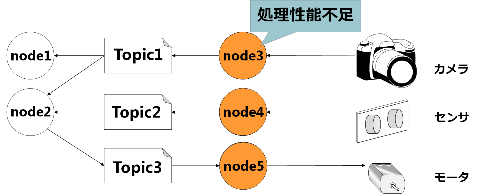
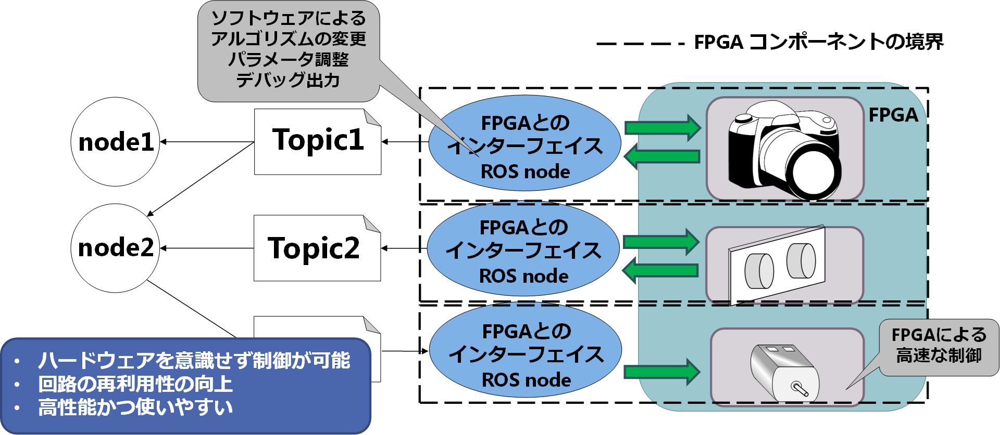

<h2>実験手順書</h2>
<h5>
宇都宮大学大学院工学研究科 
情報システム科学専攻 
横田・大津・大川研究室 
山科和史 
kazushi@virgo.is.utsunomiya-u.ac.jp 
</h5>

## はじめに
周囲の状況に応じて行動する**自律移動型ロボット**は知的画像処理などの非常に複雑活膨大な計算を行う必要があります。
高い処理性能が要求されているの対し自律移動型ロボットのバッテリ駆動のため，低消費電力化の観点から処理性能の高いプロセッサは搭載できず処理性能不足となる問題があります。  
我々はこうした問題を解決するために，ロボット制御のプラットフォームとして電力性能比が高い**FPGA(Field Programmable Gate Array)**に注目しています。しかし，FPGAにおける開発は一般のプログラミング言語(CやJava)に比べて**HDL(Hardware Description Language)**による開発となるため，開発者への負担が大変大きいです。このような問題を解決し，FPGAを容易にロボットへ導入するため，ロボットシステムの開発運用のためのソフトウェアプラットフォームである***ROS**に準拠した，FPGAのソフトウェアコンポーネント化を提案しています。  
本実験では実際に**FPGA向けの回路のコンポーネント化**，**コンポーネントのROSへの統合**を実際に体験していただき，アンケートに答えていただきます。

**本実験の専門用語の詳しい解説については[別途資料](support_doc.html)をご参照ください。**  

##FPGAのROS準拠コンポーネント化
FPGAのROS準拠コンポーネント化を行う最大の目的はFPGAの利点を生かしつつ，ソフトウェアによる制御を可能にすることで，FPGAを容易にロボットへ導入できるようにすることです。以下のようなソフトウェアのみで構築されたシステムにおいて処理不足となるような処理をFPGAによってハードウェア化し，ソフトウェアとの通信を行なうインターフェイスを設けることで，ハードウェアを意識することなくソフトウェアと同一に扱うことができます。この際，コンポーネントは**ロボット向けソフトウェア開発プラットフォームのROS(Robot Operating System)**のプロセス通信モデルに準拠します。

##　実験の目的
- 簡易なDSL記述し，cReCompを用いることでハードウェアの自動コンポーネント化する開発行程を体験する
- ROSを用いて生成したコンポーネントを実際にロボット開発に導入する

##　実験内容
#### cReCompを用いたハードウェアのコンポーネント化とROSへの統合 

本実験では大きく分けて3つのStepがあります。

1. cReCompというツールを用いてVerilog HDLで記述されたハードウェア回路をコンポーネント化する
- コンポーネントの動作検証
- ロボット開発・運用のためのソフトウェアプラットフォームであるROSへ作成したコンポーネントを統合と動作検証

3つの項目は時間測定をしながら作業していただきます。  
Step3が終了した時点でアンケート記入をしていただきます。  
また、作業が早く進み大幅に時間が余る場合はStep4に追加課題を用意していますのでそちらに取り組んでいただきます。  

##　実験の注意事項

- **実験中の休憩は自由に取っていただいてかまいません。また，途中で気分が悪くなった場合もお申し付けください。**
- **実験中の質問や被験者同士の質問・会話は原則可能ですが，できる限り指導書を元に実験を進めてください。**
- **質問や会話に関する議事録を取らせていただきます(匿名)。**
- **実験の各項目が終了したら時間メモシートへ時間の記入，また実験後は別途専用フォームにて入力をお願いします。**

## 実験手順
[step0: 実験の準備](step0.html)  
[step1: cReCompを用いてVerilog HDLで記述されたハードウェア回路をコンポーネント化](step1.html)  
[Step2: コンポーネントの動作検証](step2.html)  
[Step3: ROSへコンポーネントと統合と動作検証](step3.html)  
[Step4: 追加課題](step4.html)  

## 時間の記入
以下のURLにて時間の入力の記入をお願いします。  
[時間入力フォーム](http://goo.gl/forms/jBFCdQA3aN)

##アンケート
実験終了後、以下のURLでアンケートに回答してください。  
[アンケート入力フォーム](http://goo.gl/forms/2rMYIMClPp)
