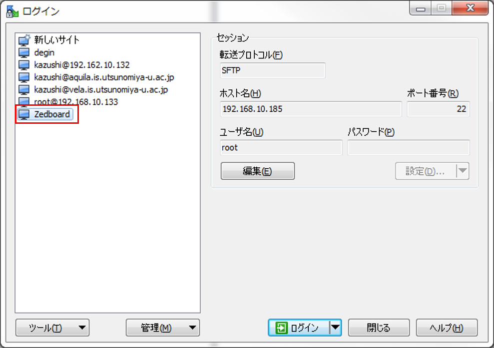
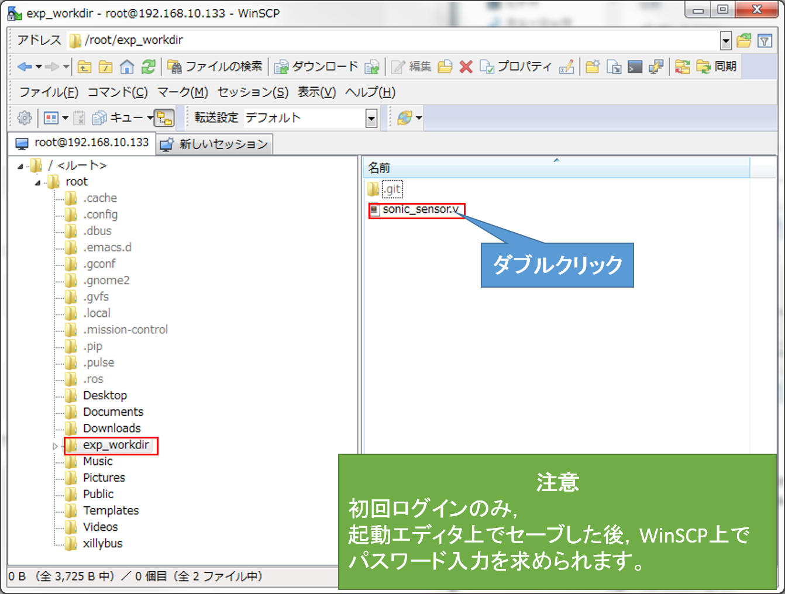
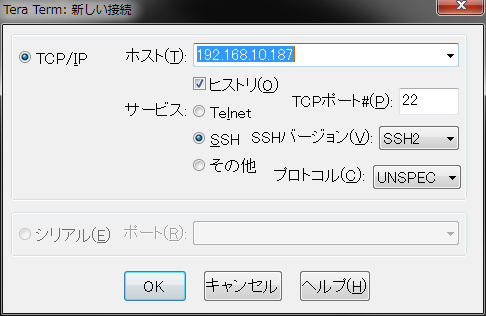
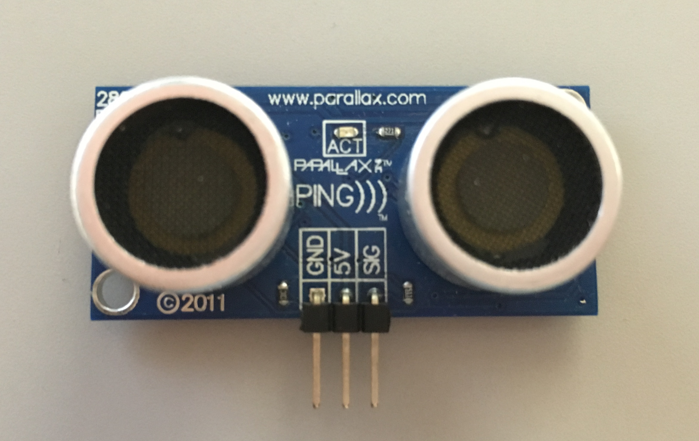
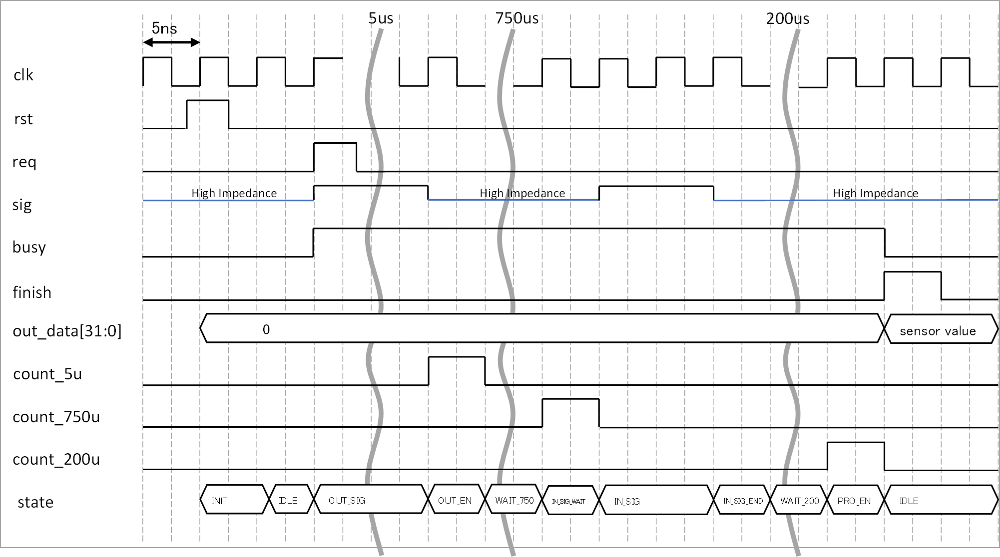
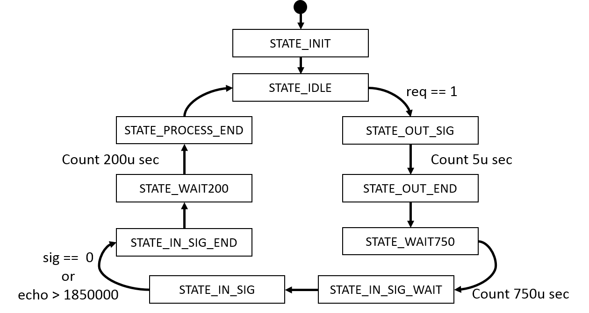

#### step0: 実験の準備<br>(PC上での作業)

**1：**　PC，FPGAボードの電源をつける  
**2：**　PCにログインし，Teratermを開く  
**3：**　Teratermを開き何度かEnterキーを押すと下記のような表示がされる。  

```
root@localhost:~#
root@localhost:~#
root@localhost:~#
```

**4：**　lsコマンドで`exp_workdir`があるか確認する  
**5：**　以下のコマンドで`exp_workdir`へ入り`sonic_sensor.v`があるか確認する
```
cd ~/exp_workdir; ls
```
**6：**　WinSCPによってZedboard内の`exp_workdir`へログインする。パスワードは`root`



**7** dateコマンドで時間の設定を行う 書式`date MMDDHHmm[[CC]YY]`  
例は2016年2月17日10：00のとき  
```
date 021710002016
```

**基本的に`exp_workdir`内で作業を行っていただきます。 `exp_workdir`はこれ以降，ワークスペースと称します。**  

**各ファイルの編集方法**  
Zedboard上のLinuxにはemacsもインストールされていますのでそちらでもファイルの編集ができます。  
**WinSCPにおけるファイルの編集の仕方**  
任意のディレクトリ，ファイルを選択することで，PC上でエディタが起動します。  
</img>  

**Teratermによるssh接続**  
コンソールが1つで足りない際はTeratermによるssh接続が可能です。
Teraterm上のメニューバーの`ファイル→新しい接続`
を選択し，  
以下のような画面において*ホスト*にipアドレス(自分のZedboardのipアドレス)を入力するとで接続できます。



**実験中のファイル編集について**
実験中のファイル編集について以下のような表現があります。

```diff
-　削除
+　追加
```

####　コンポーネント化対象のハードウェア：超音波センサ制御回路
本実験においてコンポーネント化対象として超音波センサとその制御回路`sonic_sensor.v`を扱います。  
なお，使用する超音波センサは以下のものです。

[PING))) Ultrasonic Distance Sensor | 28015 | Parallax Inc](https://www.parallax.com/product/28015)

</img>

制御回路`sonic_sensor.v`では`req`信号を１にアサートすることでセンサによる距離計測が始まります。
計測中はbusyがアサートし，計測の終了と同時に0へデアサートします。この際，finishが1クロックだけアサートしセンサの計測値がout_dataより出力されます。
以下に超音波センサの制御回路`sonic_sensor.v`のタイミングチャート，入出力ポートと状態遷移を示します。

**タイミングチャート**  
</img>

**各入出力ポートの説明**  

| port name |  type  | bit width |             tips             |
|-----------|--------|-----------|------------------------------|
| clk       | input  |         1 | クロック入力                 |
| rst       | input  |         1 | リセット入力                 |
| req       | input  |         1 | require信号                  |
| sig       | inout  |         1 | 超音波センサにつながる信号   |
| busy      | output |         1 | 処理中は1になります          |
| finish    | output |         1 | 処理が終了すると1になります  |
| out_data  | output |        32 | 結果として出力されるセンサ値 |

**ステート表**

|    ステート名     |        アクション         |
|-------------------|---------------------------|
| STATE_INIT        | 初期状態                  |
| STATE_IDLE        | アイドル状態(req信号待ち) |
| STATE_OUT_SIG     | センサからパルスを発信    |
| STATE_OUT_END     | パルス発信の終了          |
| STATE_WAIT750     | ホールドオフ              |
| STATE_IN_SIG_WAIT | 計測待ちステート          |
| STATE_IN_SIG      | 計測中                    |
| STATE_IN_SIG_END  | 計測終了                  |
| STATE_WAIT200     | 次の計測までの遅延        |
| STATE_PROCESS_END | 計測終了                  |

**状態遷移図**  
</img>

