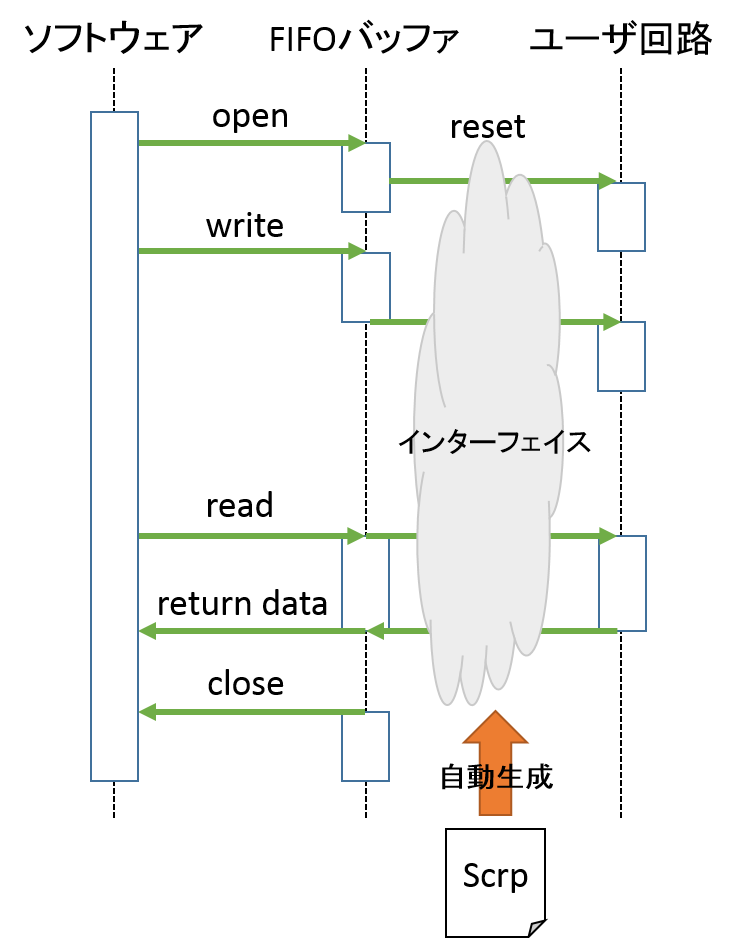

#### Step1: cReCompを用いてVerilog HDLで記述されたハードウェア回路をコンポーネント化<br>(Zedboard：Teratermでの作業)

#####　cReCompのイントール
下記のコマンドでcReCompをワークスペース内にインストールします。
```
cd ~/exp_workdir
export GIT_SSL_NO_VERIFY=1
git config --global http.proxy http://proxya.cc.utsunomiya-u.ac.jp:8080
git config --global https.proxy https://proxya.cc.utsunomiya-u.ac.jp:8080
git clone https://github.com/kazuyamashi/cReComp.git
cd cReComp
```
この際に作成されたディレクトリは以下のようになります。

```
cReComp/
|--devel/
|--lib/
|--scrp/
|--sub_module/
|--cReComp.py
|--README.md
```
- devel/
	- ツールの生成物
- lib/
	- cReCompを実行するのに用いるライブラリ
- scrp/
	- コンポーネント化に必要な設定ファイル，簡易DSL記述をするScrpファイル
- sub_module/
	- コンポーネント化対象となるユーザロジックが記述されたVerilogファイル
- cReComp.py
	- メインツール

##### DSLファイルの記述



cReCompではscrpファイルへの簡易なDSL（Domain-Specific Language）記述でコンポーネントの自動生成ができます。  
Scrpファイルで行うことは以下の要素を含みます。  

- コンポーネント化対象のハードウェアとソフトウェアの間でどのようにデータをやり取りを行うかの定義
- コンポーネント化対象のハードウェアに対する信号の配線

Scrpファイルにおいて定義された情報をもとにインターフェイスが自動生成され，ソフトウェアとユーザ回路は  
FIFOバッファを介してデータ通信が可能です。  

以下のコマンド書式によってscrpファイルのテンプレートを作成します。  

```
./cReComp.py -s [scrpの名前] [コンポーネント化対象のモジュール名]
```  

本実験では以下のように入力してください。

```
cd ~/exp_workdir
cp sonic_sensor.v cReComp/sub_module/;cd cReComp
./cReComp.py -s sensor_ctl sonic_sensor
```
この際，コンポーネント化対象である`sonic_sensor`の指定をすることで最低限必要なDSL記述がされた  
**Scrpファイル**が生成されます

正常にScrpファイルの生成ができた場合，以下のような出力がされ，`scrp`内にファイルができます。

```
locate sonic_sensor.v
generate sensor_ctl.scrp in srcp/
```

生成されたscrpファイルは以下のようになっています。なお，**//**がついているものはコメントアウトです。

```
module_name sample
//option_port{}
//use_fifo_8
//use_fifo_32
//make_8_alw{}
//make_32_alw{}
//
//r_cycle_32
//rw_condition_32{
//if()
//}
//w_cycle_32
//
//r_cycle_8
//rw_condition_8{
//if()
//w_cycle_8
//}
//reg_list{}
//wire_list{}
sub_module_name sonic_sensor uut
assign_port sonic_sensor normal{
	clk=
	rst=
	req=	sig=

	busy=
	finish=
	out_data=
}
end
```

Scrpファイルでは設定する項目はフラグとそれに属する要素で処理します。設定したい項目のフラグのコメントアウトを  
解除し，編集することをここでは**設定**と称します。それぞれのフラグを説明します。


|              フラグ               |                                       設定できる項目                                        |                 書式                 |
|-----------------------------------|---------------------------------------------------------------------------------------------|--------------------------------------|
| module_name                       | 生成するインターフェイスの名前                                                              | [module name]                        |
| option_port                       | デフォルトで生成されるポート以外に<br>追加したいポートを宣言する                            | [入出力:i,o,io] [ビット幅] [信号名]  |
| use_fifo_32<br>use_fifo_8         | HW/SW間の通信に32，8ビットのFIFOを用いる                                                    | コメント解除のみ                     |
| make_32_alw<br>make_8_alw         | 32，8ビットのFIFOの制御ステートマシンを自動生成<br>FIFOへのread/writeに使用する信号の宣言 | [read:r/write:w] [ビット幅] [信号名] |
| r_cycle_32<br>r_cycle_8           | FIFOから何回データを読み込むかの回数                                                        | [number]                             |
| rw_condition_32<br>rw_condition_8 | FIFOへのreadとwriteの切り替え条件                                                           | if(条件式)                           |
| w_cycle_32<br>w_cycle_8           | FIFOへ何回データを書き込むかの回数                                                          | [number]                             |
| reg_list                          | 任意のレジスタの宣言                                                                        | [ビット幅] [信号名]                  |
| wire_list                         | 任意のワイヤ宣言                                                                            | [ビット幅] [信号名]                  |

**Scrpファイルの記述例**
```
module_name sample
option_port{
	i,32,in_data
}
use_fifo_8
make_8_alw{
	w,32,out_data
}
w_cycle_8 1
```


また，コンポーネント化対象である`sonic_sensor`の指定をしたことにより以下の部分は自動生成されます。  
ここでは`sonic_sensor`のもつ入出力ポートが全て表示されます。各信号に続く**=**
のあとに接続したい信号名を記述することで  
インターフェイスに自動的にインスタンスが生成され，`sonic_sensor`が接続されます。

```
sub_module_name sonic_sensor uut
assign_port sonic_sensor normal{
	clk=
	rst=
	req=
	busy=
	sig=
	finish=
	out_data=
}
end
```

生成されたscrpファイルをsonic_sensor.vの仕様にあわせて編集していきます。  
なお，sensor_ctl.scrpの編集に限ってはコピー&ペーストはせずに手入力をお願いします。  

1. ソフトウェアからリクエスト値(1)を送信することで，超音波センサの計測がスタートするような構造にします。また，データ通信には32bitのFIFOを使用することとします。  
- option_portで宣言している`io,1,sig_out`は超音波センサ本体に接続するための入出力ポートです。  
	- センサはこのポートを介して超音波の入出力をします。  
- FIFOからのデータ受け取りのための信号はreq_in，データを渡すための信号はsensor_dataとし，それぞれ32bitにします。
- FIFOへの読み込み(ソフトウェアから受け取った値)と書き込み(ソフトウェアへ渡す値)は各1回に指定します。
- FIFOへのread/writeの切り替え条件としては，計測が終了したらFIFOへのセンサデータ書き込みを行うようにします。
- ユーザ回路の配線のためのワイヤ宣言を行います。
- ユーザ回路への配線を行います。

**sensor_ctl.scrp**

```diff

- module_name - sample
+ module_name + sensor_ctl
-//option_port{}
+ option_port{
+	io,1,sig_out
+ }
- //use_fifo_8
- //use_fifo_32
+ use_fifo_32
- //make_8_alw{}
- //make_32_alw{}
+ make_32_alw{
+ 	r,32,req_in
+ 	w,32,sensor_data
+ }
- //
- //r_cycle_32
+ r_cycle_32 1
- //rw_condition_32{
- //if()
- //}
+ rw_condition_32{
+ if(busy_sensor==0 && finish_sensor)
+ }
- //w_cycle_32
+ w_cycle_32 1
- //
-//r_cycle_8
-//rw_condition_8{
- //if()
- //w_cycle_8
- //}
- //reg_list{}
- //wire_list{}
+ wire_list{
+ 	1,busy_sensor
+ 	1,finish_sensor
+ }
sub_module_name sonic_sensor uut
assign_port sonic_sensor normal{
-     clk=
-     rst=
-     req=
-     busy=
-     sig=
-     finish=
-     out_data=
+ 	req=req_in
+ 	busy=busy_sensor
+ 	sig=sig_out
+ 	finish=finish_sensor
+ 	out_data=sensor_data
```

<!-- 以下の表にしたがって記述してください。なお，今回の実験では8bitのFIFOは使用しません。 -->

<!-- |                           使用するフラグ                            |                                                   設定記述                                                   |
|---------------------------------------------------------------------|--------------------------------------------------------------------------------------------------------------|
| module_name                                                         | sensor_ctl                                                                                                   |
| option_port                                                         | io,1,sig_out                                                                                                 |
| use_fifo_32                                                         | コメント解除                                                                                                 |
| make_32_alw                                                         | r,32,req_in<br>w,32,sensor_data                                                                              |
| r_cycle_32                                                          | 1                                                                                                            |
| rw_condition_32                                                     | busy_sensor==0 && finish_sensor                                                                              |
| w_cycle_32                                                          | 1                                                                                                            |
| wire_list                                                           | 1,busy_sensor<br>1,finish_sensor                                                                             |
| sub_module_name sonic_sensor uut<br>assign_port sonic_sensor normal | req=req_in<br>busy=busy_sensor<br>sig=sig_out<br>finish=finish_sensor<br>out_data=sensor_data | -->


編集後のScrpファイルは以下のようになります。  
**sensor_ctl.scrp**
```
module_name sensor_ctl
option_port{
	io,1,sig_out
}
use_fifo_32
make_32_alw{
	r,32,req_in
	w,32,sensor_data
}
r_cycle_32 1
rw_condition_32{
if(busy_sensor==0 && finish_sensor)
}
w_cycle_32 1
wire_list{
	1,busy_sensor
	1,finish_sensor
}
sub_module_name sonic_sensor uut
assign_port sonic_sensor normal{
	req=req_in
	busy=busy_sensor
	sig=sig_out
	finish=finish_sensor
	out_data=sensor_data
}
end
```

##### コンポーネントの生成

Scrpファイルの記述が終了したら以下のコマンドでコンポーネントの自動生成を行いましょう。

```
cd ~/exp_workdir/cReComp
./cReComp.py scrp/sensor_ctl.scrp
```

コンポーネントの生成に成功したら以下の出力がされます。

```
locate sonic_sensor.v
Generate sensor_ctl.v in ./devel
```

コンポーネントは`cReComp/devel/sensor_ctl`内に生成され，以下のようなファイルが含まれます。

```
/sensor_ctl
|--lib_cpp.h
|--sensor_ctl.cpp
|--sensor_ctl.v
|--sonic_sensor.v
```

| ファイルの名前 |                                                                      |
|----------------|----------------------------------------------------------------------|
| lib_cpp.h      | クラス定義                                                           |
| sensor_ctl.cpp | ハードウェアとデータのやり取りを行うソフトウェア                     |
| sensor_ctl.v   | ハードウェアとソフトウェア間のデータのやり取りを行うインターフェイス |
| sonic_sensor.v | コンポーネント化対象の回路(コピー)                                   |
