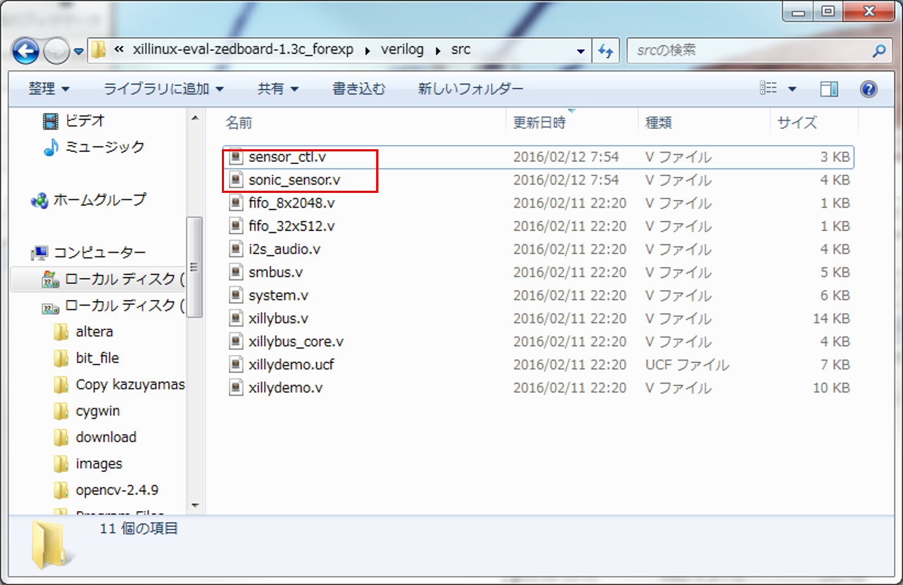
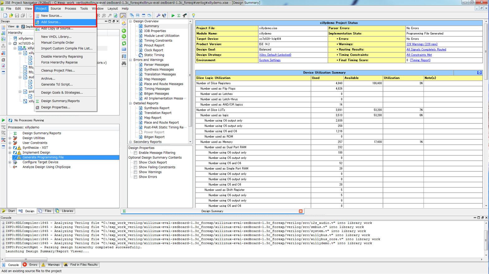
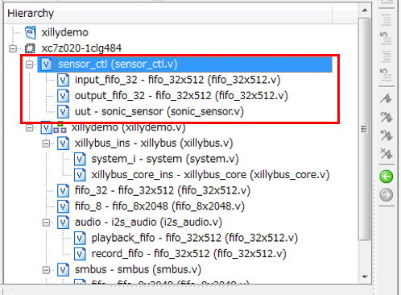
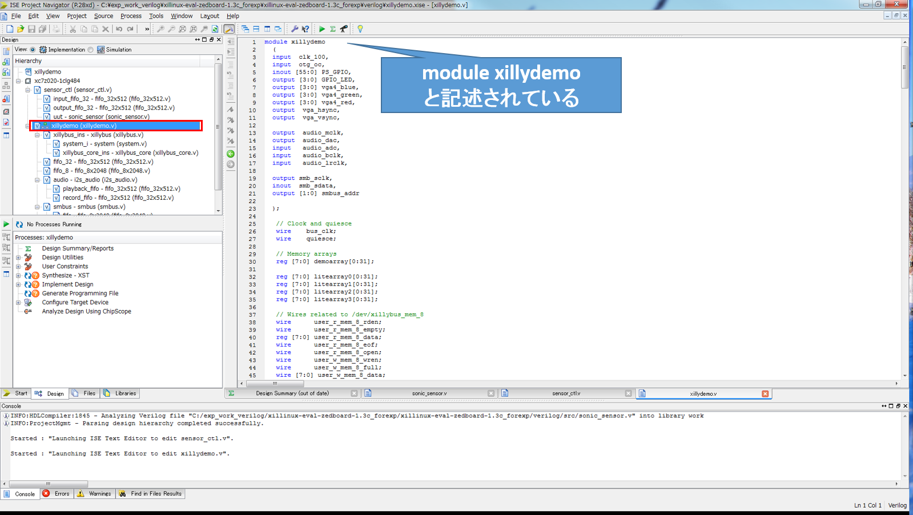
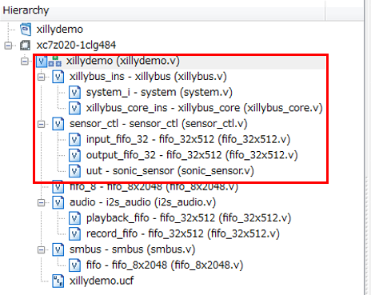
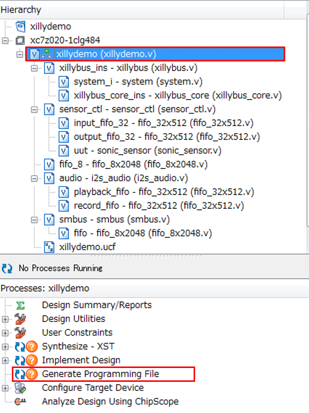

#### Step2: コンポーネントの動作検証

##### ハードウェアの論理合成<br>(PC上での作業)

生成したコンポーネントの動作確認を行っていきます。  
以下の場所から検証用のプロジェクトファイルをダウンロードします。  
**ダウンロードの際セキュリティの警告をされてもダウンロードを継続してください**

[download](http://aquila.is.utsunomiya-u.ac.jp/~kazushi/xillinux-eval-zedboard-1.3c_forexp.zip)

ダウンロードしたファイルはCドライブ直下の`exp_work_verilog`へコピーし，展開してください。  
`C:\exp_work_verilog\xillinux-eval-zedboard-1.3c_forexp.zip`  
展開後は以下のようなディレクトリがあるはずです。

```
xillinux-eval-zedboard-1.3c_forexp
|--bootfiles/
|--cores/
|--runonce/
|--system/
|--verilog/
```
前ステップで生成した`sensor_ctl.v`と`sonic_sensor.v`を`verilog\src`へコピーしてください。  
ファイルのコピーはWinSCPから対象のファイルをコピー先へドラッグすれば可能です。



`xillinux-eval-zedboard-1.3c_forexp\verilog`内にある**xillydemo.xise**をダブルクリックして開発環境を起動します。  
project→Add Sourceで先ほどコピーした`sensor_ctl.v`と`sonic_sensor.v`をプロジェクトへ追加します。



ソースを追加した場合，左横のHierarchyは以下のようになります。

>

`sensor_ctl (sensor_ctl.v)`をダブルクリックすると環境上にソースコードが表示されます。
ソースコード中の以下の部分をコピーしてください。

```verilog
//13行目あたりからコピー
// //copy this instance to top module
//sensor_ctl sensor_ctl(
//.clk(bus_clk),
//.rst_32(!user_w_write_32_open && !user_r_read_32_open),
//.din_32(user_w_write_32_data),
//.wr_en_32(user_w_write_32_wren),
//.rd_en_32(user_r_read_32_rden),
//.dout_32(user_r_read_32_data),
//.full_32(user_w_write_32_full),
//.empty_32(user_r_read_32_empty),
//
// .sig_out(sig_out)
//);
```

`xillybus (xillydemo.v)`をダブルクリックするとxillydemo.vが環境上に表示されます。  
以下の指示に従って編集してください。



```verilog
//20行目あたり
  output [1:0] smbus_addr,
  inout sig_out
};

//264行目あたりから以下をコメントアウト(Alt + c)
//   fifo_32x512 fifo_32
//     (
//      .clk(bus_clk),
//      .srst(!user_w_write_32_open && !user_r_read_32_open),
//      .din(user_w_write_32_data),
//      .wr_en(user_w_write_32_wren),
//      .rd_en(user_r_read_32_rden),
//      .dout(user_r_read_32_data),
//      .full(user_w_write_32_full),
//      .empty(user_r_read_32_empty)
//      );

//すぐ下に前にコピーしたものをペーストしてコメントを解除(Shift + Alt + C)

sensor_ctl sensor_ctl(
.clk(bus_clk),
.rst_32(!user_w_write_32_open && !user_r_read_32_open),
.din_32(user_w_write_32_data),
.wr_en_32(user_w_write_32_wren),
.rd_en_32(user_r_read_32_rden),
.dout_32(user_r_read_32_data),
.full_32(user_w_write_32_full),
.empty_32(user_r_read_32_empty),

 .sig_out(sig_out)
);
```

以上の編集が終わると左横のHierarchyは以下のようになります。



最後に`xillydemo.ucf`をダブルクリックして，以下のように編集します。

```python
#77行目あたり
NET  PS_GPIO[24] LOC = Y11  | IOSTANDARD = LVCMOS33;	# JA1
NET  PS_GPIO[25] LOC = AA11 | IOSTANDARD = LVCMOS33;	# JA2
NET  PS_GPIO[26] LOC = Y10  | IOSTANDARD = LVCMOS33;	# JA3
#LOC = AA9をLOC = D21へ変更
NET  PS_GPIO[27] LOC = D21  | IOSTANDARD=  LVCMOS33; 	# JA4
NET  PS_GPIO[28] LOC = AB11 | IOSTANDARD = LVCMOS33;	# JA7
NET  PS_GPIO[29] LOC = AB10 | IOSTANDARD = LVCMOS33;	# JA8
NET  PS_GPIO[30] LOC = AB9  | IOSTANDARD = LVCMOS33;	# JA9
NET  PS_GPIO[31] LOC = AA8  | IOSTANDARD = LVCMOS33;	# JA10
#以下の行を追加
NET  sig_out LOC = AA9  | IOSTANDARD = LVCMOS33;	

```

編集が終了したら`xillybus (xillydemo.v)`を選択した上で**Generate Programming File**をダブルクリックします。
この処理は論理合成と呼びます。



処理が正常に終了した場合は`Process "Generate Programming File" completed successfully`のように表示されます。

#####　ソフトウェアのコンパイル<br>(Zedboard：Teratermでの作業)

Zedboardのコンソール(Teraterm)を開き以下のコマンドでディレクトリ作成&コピーしてください。

```
cd ~/exp_workdir/
mkdir test
cp cReComp/devel/sensor_ctl/sensor_ctl.cpp test/
cp cReComp/devel/sensor_ctl/lib_cpp.h test/
cd test; ls
```
`sensor_ctl.cpp`を以下のように編集します。

```cpp
//42行目あたり
int main(int argc, char const *argv[]){
	sensor_ctl obj;
	obj.set_devfile_read("/dev/xillybus_read_32");
	obj.open_devfile_read();
	obj.set_devfile_write("/dev/xillybus_write_32");
	obj.open_devfile_write();
	/*your code*/
	unsigned int val;
	while(1){
		obj.set_sensor_ctl_32(1);
		val = obj.get_sensor_ctl_32();
		if(val == 1)
			continue;
		else if(val<80000)
			cout << "1.0m" << endl;
		else if(val<82500)
			cout << "1.2m" << endl;
		else if(val<125000)
			cout << "1.5m" << endl;
		else if(val<150000)
			cout << "1.8m" << endl;
		else if(val<330000)
			cout << "2.1m" << endl;
		else if(val<550000)
			cout << "2.4m" << endl;
		else if(val<700000)
			cout << "2.7m" << endl;
		else if(val<825000)
			cout << "3.0m" << endl;
	}

	obj.close_devfile_read();
	obj.close_devfile_write();
	return 0;
}
```

編集が終了したらコンパイルしましょう。
```
g++ -o sensor_ctl sensor_ctl.cpp
```
##### コンポーネントのテスト実行

論理合成をしたハードウェアをZedboardへ導入します。Teraterm上で`poweroff`と入力してZedboardの電源を切ります。  
電源を切ったらSDカードを抜き，PCのSDカードスロットへ挿入します。  
SDカードをPCへ挿入すると以下のようなファイルがあります。

```
|--boot.bin
|--devicetree.dtb
|--uImage
|--xillydemo.bit
```

先ほど論理合成をしたハードウェア情報をSDカードへコピーします。

`C:\exp_work_verilog\xillinux-eval-zedboard-1.3c_forexp\xillinux-eval-zedboard-1.3c_forexp\verilog`内の`xillydemo.bit`をSDカード内に上書きコピーします。  
コピー後，SDカードを抜き，Zedboardへ再挿入します。  
Zedboardの電源を入れ，Teratermの起動とWinSCPによるログインをしなおします。

以下のコマンドでテストプログラムを起動します。

```
cd exp_workdir/test/
./sensor_ctl
```

動作検証に成功した場合，以下のような出力され,超音波センサのLEDが光り続けます。

```
2.1m
1.8m
1.8m
1.5m
1.5m
1.5m
1.5m
```